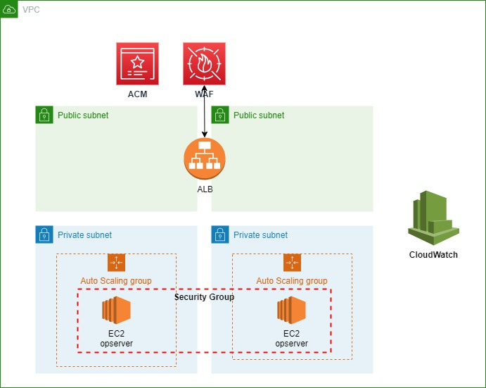

# opserver 

## About this module
### Domain
- http://www.dot.tk/zh/index.html

### Infrastructure 
- This module will deploy Opserver and all the AWS infrastructure required
- It will create 1 VPC (cidr 10.0.0.0/16), and 4 subnets (2 public ones, 2 private ones)
- The opsever will be deployed to two private AZs separately for HA
- Auto Scaling Group will be used to make the system more resilient 
- Application Load Balancer will be used as application level load balance
- ACM will be used to manager certificate
- WAF/Shield are designed to be used for security
- NACL/SG are designed with least privilege mode 

# System diagram

# Components
- ec2.tf (windows os & opsever)
- sg.tf (security groups, for ALB, EC2 instances)
- vpc.tf (vpc & igw config )
- subnets.tf (2 public subnets & 2 private subnets)
- routing.tf (2 public routes & 2 private routes)
- nacls.tf (NACLs for subnets)
- alb.tf (Application Load Balancer for HA, ALB listener, ALB forwarding rules)

# Problems experienced
- No experiences on WINDOWS, not sure how to config opsever on windows instance
- Firewall rules is widely open, need to narrow it down
- With default AMI (windows sever 2019) on AWS, need to manually config IIS anc download opsever source
- Jump box required if we place EC2 instance into private subnet, the key setup is not fully automated
- Automate IIS config on EC2 instance
- Can't download the GIT on the windows instance, fixed it by the solution in reference links at bottom.
- Manual action required for register certs in ACM

# Future enhancement
- Make aws resources deployment config driven (add YML config)
- This solution use windows AMI to launch EC2 instance, suggest to bake opserver AMI directly in future. 
- Automate SSH Key setup
- Automate jump box setup
- Automate the Opserver setup on windows server
- Config and enable shield to protect the web service from DDoS attack
- Associate WAF with ALB as web layer firewall

# Reference 
- [Enable IIS on windows server](https://enterprise.arcgis.com/zh-cn/web-adaptor/latest/install/iis/enable-iis-2016-components-server.htm )
- [IIS on the AWS Cloud](https://aws-quickstart.github.io/quickstart-microsoft-iis/#_overview)
- [allow file downloads using Internet Explorer](https://aws.amazon.com/premiumsupport/knowledge-center/ec2-windows-file-download-ie/?nc1=h_ls)